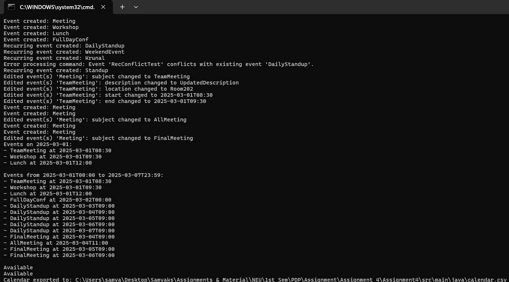
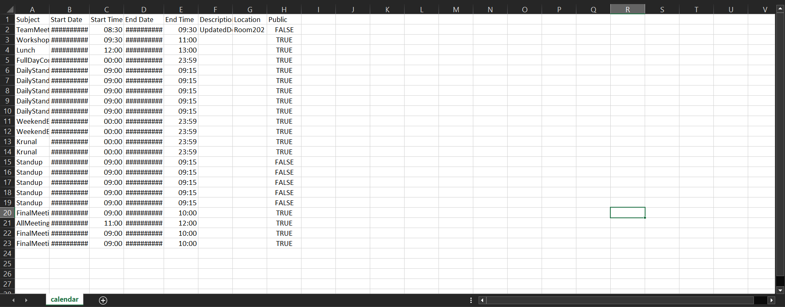

# Virtual Calendar Application

## Overview

This project implements a comprehensive virtual calendar application that mimics the core features of popular calendar software like Google Calendar and iCalendar. Built using Java with Maven, the application follows MVC (Model-View-Controller) architecture and SOLID design principles to ensure maintainability, scalability, and extensibility.

## Visual Demonstrations

### Command Line Interface

*Interactive mode showing various calendar operations and commands*

### Export Functionality

*Calendar export functionality generating CSV files*

### Google Calendar Integration

*Exported calendar data successfully imported into Google Calendar*

### Test Coverage and Quality Assurance

*Comprehensive mutation testing ensuring 90%+ test strength, mutation coverage, and line coverage.*

## Key Features

### **Event Management**
- **Single Events**: Create events with subject, start/end date-time, location, and description
- **Recurring Events**: Create repeating events with flexible scheduling options
- **All-Day Events**: Events with All Day duration
- **Conflict Detection**: Automatic detection and optional auto-decline of conflicting events

### **Event Editing**
- **SINGLE Mode**: Modify individual event instances
- **FROM Mode**: Modify all events in a series from a specific point forward
- **ALL Mode**: Modify all events with the same subject

### **Query and Search**
- Print events for specific dates or date ranges
- Check calendar availability at specific times
- Advanced filtering and search capabilities

### **Export and Integration**
- Export to CSV format compatible with Google Calendar
- Automatic expansion of recurring events into individual occurrences
- Seamless integration with external calendar applications

### **User Interface**
- **Interactive Mode**: Real-time command input with immediate feedback
- **Headless Mode**: Batch processing from command files
- Comprehensive command-line interface with intuitive syntax


## System Architecture

The application follows the MVC pattern with clear separation of concerns:

### UML Class Diagrams

*Model layer showing event structures and calendar management*


*Controller layer handling business logic and command processing*


*View layer managing user interaction and display*


*Complete system overview showing all components and relationships*

## How to Run the Program

### Prerequisites

- Java JDK 8 or later.
- JUnit 4 (for running the tests).

### Method 1: Using Maven (Recommended)

1. **Build the Project:**
   ```bash
   mvn clean compile
   ```

2. **Run Interactive Mode:**
   ```bash
   mvn exec:java -Dexec.mainClass="view.CalendarApp" -Dexec.args="--mode interactive"
   ```

3. **Run Headless Mode:**
   ```bash
   mvn exec:java -Dexec.mainClass="view.CalendarApp" -Dexec.args="--mode headless path/to/commands.txt"
   ```

### Method 2: Direct Compilation (Legacy)

1. **Navigate to Source Directory:**
   ```bash
   cd src/main/java
   ```

2. **Compile Using Batch Script:**
   ```bash
   compile.bat
   ```

3. **Run Interactive Mode:**
   ```bash
   java view.CalendarApp --mode interactive
   ```

4. **Run Headless Mode:**
   ```bash
   java view.CalendarApp --mode headless comprehensive_test.txt
   ```

### Quick Demo: Comprehensive Test

Execute the comprehensive test to see all features in action:

```bash
cd src/main/java
"Run Comprehensive_Test_Example.bat"
```

This runs through all major functionalities and generates a `calendar.csv` export file.

## Command Examples

### Creating Events
```
create-event "Team Meeting" "2024-01-15" "10:00" "11:00" "Conference Room A" "Weekly team sync"
create-recurring-event "Workout" "2024-01-01" "07:00" "08:00" "Gym" "Morning exercise" "Mon,Wed,Fri" 12
```

### Querying Calendar
```
print-events "2024-01-15"
print-events "2024-01-01" "2024-01-31"
is-busy "2024-01-15" "10:30"
```

### Editing Events
```
edit-event "Team Meeting" "2024-01-15" "10:00" SINGLE subject "Project Review"
edit-event "Workout" "2024-01-01" "07:00" ALL time "06:00" "07:00"
```

### Export Calendar
```
export-calendar "my_calendar.csv"
```

## Advanced Features

### Conflict Management
- **Auto-decline**: Automatically reject conflicting events when enabled
- **Manual Resolution**: Interactive conflict resolution in interactive mode
- **Conflict Visualization**: Clear indication of scheduling conflicts

### Recurring Event Patterns
- **Weekday Selection**: Choose specific days (Mon, Tue, Wed, etc.)
- **Count-based**: Repeat for a specified number of occurrences
- **Date-based**: Repeat until a specific end date
- **Individual Editing**: Modify single instances or entire series

### Data Persistence
- **CSV Export**: Google Calendar compatible format
- **Command History**: Track all operations for audit trails
- **Batch Processing**: Execute multiple commands from files

## Testing and Quality Assurance

### Comprehensive Test Suite
- **Unit Tests**: Individual component testing
- **Integration Tests**: End-to-end workflow validation
- **Mutation Testing**: 90%+ test strength using PIT framework
- **Edge Case Coverage**: Robust error handling and validation

### Running Tests
```bash
mvn test                    # Run all unit tests
mvn org.pitest:pitest-maven:mutationCoverage  # Run mutation testing
```


## Features That Work

- **Single Event Creation:**  
  - Creating single events with optional end date/time.
- **Recurring Event Creation:**  
  - Creating recurring events that repeat on specific weekdays (both for a fixed number of occurrences and until a given end date).
- **Conflict Detection:**  
  - Conflicts are checked during event creation. If auto-decline is enabled, the creation is rejected.
- **Querying Events:**  
  - Printing events on a specific date and within a given time range.
  - Checking busy status at a specific date/time.
- **Export to CSV:**  
  - The calendar can be exported to a CSV file.
- **Editing Events:**  
  - Basic editing of events is supported (subject, description, location, start time, and end time).  
  - Supports SINGLE, FROM, and ALL modes for editing.
  

# Code Nature
- **--autoDecline**  
  - --autoDecline defaults to false if not provided.
- **private/public property**  
  - If not provided defaults to public.
- **Effective Start/End Time**  
  - If start time is not provided, it defaults to 00:00, which is the start of the day.
  - If end time is not provided, it defaults to 23:59, which is the end of the day.

## Resources and Documentation

- **Complete Documentation**: Available in `/docs` folder (Javadoc generated)
- **Test Commands**: Sample valid/invalid commands in `/res/Valid and Invalid Commands.txt`
- **UML Diagrams**: Complete system architecture in `/res/UML Diagram.pdf`
- **Test Reports**: Mutation testing reports in `/res/pit-reports/`


## Acknowledgments

This project demonstrates advanced software engineering principles including SOLID design, comprehensive testing, and professional documentation standards. The implementation showcases enterprise-level code quality and architectural decisions suitable for production environments.

Thank you for reviewing our Virtual Calendar Application!
+ This was a project at Northeastern University, an academic project in Program Design Paradigm (PDP) under Prof Amit Shesh.
