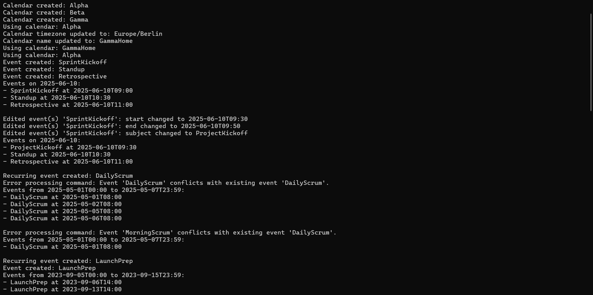

# Virtual Calendar Application
> **New in Sprint 3:** Multi-calendar support with timezone management, enhanced event operations, and universal conflict detection.
> **Full changelog →** [`changelog.md`](changelog.md)

## Overview

This project implements a comprehensive virtual calendar application that mimics the core features of popular calendar software like Google Calendar and iCalendar. Built using Java with Maven, the application follows MVC (Model-View-Controller) architecture and SOLID design principles to ensure maintainability, scalability, and extensibility.

**Sprint 3 Evolution:** Building upon Assignment 4's foundation, Assignment 5 introduces multi-calendar support with timezone management, enhanced event operations, and improved architectural design. The system now supports multiple calendars with unique names and IANA timezones, event copying between calendars, and automatic timezone migration.

## Visual Demonstrations

### Command Line Interface

*Interactive mode showing various calendar operations and commands*

### Export Functionality

*Calendar export functionality generating CSV files*

### Google Calendar Integration

*Exported calendar data successfully imported into Google Calendar*

### Test Coverage and Quality Assurance

*Comprehensive mutation testing ensuring 90%+ test strength, mutation coverage, and line coverage.*

## Key Features

### **Multi-Calendar Management**
- **Calendar Creation**: Create multiple calendars with unique names and IANA timezones
- **Calendar Selection**: Use `use calendar` command to set active calendar context
- **Calendar Editing**: Modify calendar properties including name and timezone
- **Timezone Migration**: Automatic timezone conversion when editing calendar properties

### **Event Management**
- **Single Events**: Create events with subject, start/end date-time, location, and description
- **Recurring Events**: Create repeating events with flexible scheduling options
- **All-Day Events**: Events with All Day duration
- **Universal Conflict Detection**: Automatic conflict detection enabled by default for all events
- **Event Copy Operations**: Copy events between calendars with automatic timezone conversion

### **Event Editing**
- **SINGLE Mode**: Modify individual event instances
- **FROM Mode**: Modify all events in a series from a specific point forward
- **ALL Mode**: Modify all events with the same subject

### **Query and Search**
- Print events for specific dates or date ranges
- Check calendar availability at specific times

### **Export and Integration**
- Export to CSV format compatible with Google Calendar
- Automatic expansion of recurring events into individual occurrences
- Seamless integration with external calendar applications

### **User Interface**
- **Interactive Mode**: Real-time command input with immediate feedback
- **Headless Mode**: Batch processing from command files
- Comprehensive command-line interface with intuitive syntax

## System Architecture

The application follows the MVC pattern with clear separation of concerns:

### UML Class Diagrams

*Model layer showing event structures and calendar management*


*Controller layer handling business logic and command processing*


*View layer managing user interaction and display*


*Complete system overview showing all components and relationships*

## How to Run the Program

### Prerequisites
- Java JDK 8 or later installed on your system
- Command prompt or terminal
- JUnit 4 for running tests

### Running the Application

The application is now distributed as a compiled JAR file for easy execution:

#### Interactive Mode
Navigate to the `res/` directory and run:
```bash
java -jar Assignment5.jar --mode interactive
```
You will then see a prompt where you can type commands directly.

#### Headless Mode
1. **Using provided demonstration file:**
   ```bash
   run headless.bat
   ```
   or manually:
   ```bash
   java -jar Assignment5.jar --mode headless headless.txt
   ```

2. **Using custom command file:**
   Create a text file with one command per line, ensuring the last line is `exit`, then run:
   ```bash
   java -jar Assignment5.jar --mode headless your_commands.txt
   ```

### Development Setup (Optional)

For development and testing purposes:

#### Method 1: Using Maven (Recommended)
1. **Build the Project:**
   ```bash
   mvn clean compile
   ```

2. **Run Interactive Mode:**
   ```bash
   mvn exec:java -Dexec.mainClass="view.CalendarApp" -Dexec.args="--mode interactive"
   ```

3. **Run Headless Mode:**
   ```bash
   mvn exec:java -Dexec.mainClass="view.CalendarApp" -Dexec.args="--mode headless path/to/commands.txt"
   ```

## Advanced Features

### Multi-Calendar Operations
- **Calendar Context**: All operations are performed within the context of the active calendar
- **Cross-Calendar Copy**: Copy events between calendars with automatic timezone adjustment
- **Timezone Awareness**: Events maintain their logical time when copied across timezones

### Enhanced Conflict Management
- **Universal Auto-decline**: All events now check for conflicts by default
- **Smart Conflict Resolution**: Improved conflict detection across calendar boundaries

### Recurring Event Patterns
- **Weekday Selection**: Choose specific days (Mon, Tue, Wed, etc.)
- **Count-based**: Repeat for a specified number of occurrences
- **Date-based**: Repeat until a specific end date
- **Individual Editing**: Modify single instances or entire series

### Data Persistence
- **CSV Export**: Google Calendar compatible format
- **Command History**: Track all operations for audit trails
- **Batch Processing**: Execute multiple commands from files

## Testing and Quality Assurance

### Comprehensive Test Suite
- **Unit Tests**: Individual component testing
- **Integration Tests**: End-to-end workflow validation
- **Mutation Testing**: 90%+ test strength using PIT framework
- **Edge Case Coverage**: Robust error handling and validation

### Running Tests
```bash
mvn test                    # Run all unit tests
mvn org.pitest:pitest-maven:mutationCoverage  # Run mutation testing
```

## Features That Work

- **Multi-Calendar Support:**
  - Create multiple calendars with unique names and IANA timezones
  - Switch between calendars using `use calendar` command
  - Edit calendar properties including timezone migration

- **Universal Conflict Detection:**
  - All events automatically check for conflicts without needing --autoDecline flag
  - Enhanced conflict resolution across calendar boundaries

- **Event Copy Operations:**
  - Copy events between calendars with automatic timezone conversion
  - Maintain event integrity across different timezone contexts

- **Single Event Creation:**  
  - Creating single events with optional end date/time
  - Default to all-day events (00:00-23:59) when end time not specified

- **Recurring Event Creation:**  
  - Creating recurring events that repeat on specific weekdays
  - Support for both fixed occurrence count and end date patterns

- **Advanced Event Editing:**  
  - Enhanced editing with SINGLE, FROM, and ALL modes
  - Refactored EditEventOperations for better separation of concerns
  - Global conflict checks ensure edits don't cause overlaps

- **Querying Events:**  
  - Print events on specific dates across active calendar
  - Print events within date/time ranges
  - Check calendar availability at specific times

- **Export to CSV:**  
  - The calendar can be exported to a CSV file.
- **Editing Events:**  
  - Basic editing of events is supported (subject, description, location, start time, and end time).  
  - Supports SINGLE, FROM, and ALL modes for editing.
  

## Resources and Documentation

- **Complete Documentation**: Available in `/docs` folder (Javadoc generated)
- **Executable JAR**: Ready-to-run application in `/res/Assignment5.jar`
- **Demo Commands**: Demonstration commands in `/res/headless.txt`
- **UML Diagrams**: Complete system architecture in `/res/UML Diagram.pdf`
- **Test Reports**: Mutation testing reports in `/res/pit-reports/`


## Acknowledgments

This project demonstrates advanced software engineering principles including SOLID design, comprehensive testing, and professional documentation standards. The implementation showcases enterprise-level code quality and architectural decisions suitable for production environments.

Thank you for reviewing our Virtual Calendar Application!
+ This was a project at Northeastern University, an academic project in Program Design Paradigm (PDP) under Prof Amit Shesh.
